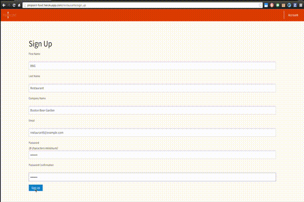
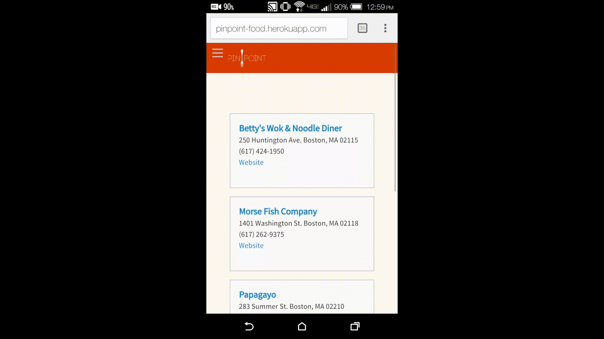

## **PinPoint**

This app provides a centralized food delivery ecosystem for customers, restaurants, and drivers to interact with a single website and provide an improved experience for all parties.

Online food delivery apps often suffer from a void of information from the customer perspective due to the lack of updates on their order, making it more difficult for them to plan their time.  PinPoint provides the ability to track the location of your food throughout the delivery process, from the restaurant to your front door.

**All test accounts are created with a password of 'password'.**

Project ER Diagram

.png)

#### **User Information**
(Test Account: user@example.com)

*Status Tracking*

On the order show page, the status will update via AJAX to allow the user to immediately see any changes made to their order by the restaurant.

*Location Tracking*

The order show page also shows the user, restaurant, and driver locations via the Google Maps Javascript API.  The two markers displayed represent the user and restaurant location, while the blue line will update and show the path of the driver in real time.  To test this functionality, leave one 'customer' browser on the order show page and then load the driver show page on a GPS-enabled mobile phone or computer.  The map will continuously update with the location of the mobile unit.

#### **Restaurant Information**
(Test Accounts: restaurant(INSERT_NUMBER_HERE)@example.com), numbers: 1-5

*Auto-population of data*

This app uses the Locu API to populate the database with restaurant location details, hours of operation, and menu items.  This is based on the 'Company Name' field during the Sign Up process.  The Locu API (Ruby wrapper is in app/models/locu_data.rb) is currently scoped to { 'locality' => 'Boston' } and { 'categories' => { 'str_id' => 'restaurants' } }.  However, these can easily be changed for different cities or any of the available filters on the API.  Boston is being used to reduce the chance of multiple entries in Locu for the company name entered during Sign Up.

Currently, hours are not being used in this application, although the data is stored in the database.  Menu items with complex options are also mostly ignored; they do appear on the menu, but you cannot place an order with those items in the cart.

*Order Status Changes*

Order status changes are made from the restaurant show page, which also serves as an order index for that restaurant.  See *Status Tracking* under User Information for demo.

#### **Driver Information**
(Test Account: driver@example.com)

Drivers are set up as Users, but with a special role.

**Currently all orders are automatically assigned to the driver test account.**

*Location Tracking*

Location tracking is enabled and/or disabled from the driver show page.  See *Location Tracking* under User Information for demo.

